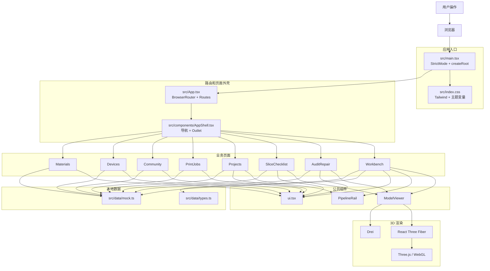

# 灵构 AI

灵构 AI 是一个面向 3D 创作与打印流程的前端原型。用户可以从自然语言描述开始，通过 AI 创作工作台逐步确认创作意图、查看模型预览、检查打印风险，并进入切片和打印任务流程。

当前项目主要用于**产品功能演示、前端页面展示和交互流程验证**。页面中的 AI 回复、3D 模型、检测结果、切片方案、打印机、耗材和打印任务数据目前使用本地 Mock 数据，暂未连接真实后端服务。

---

## 一、当前功能模块

项目围绕“从想法到实体”的流程组织前端页面，各模块之间通过项目、模型版本、检测结果和打印任务关联。

| 模块 | 功能说明 | 路由 |
|---|---|---|
| AI 创作工作台 | 通过对话确认创作需求、选择风格、查看概念方案和模型生成状态 | `/` |
| AI 对话与创作决策 | 展示需求理解、创作建议、概念预览和操作节点 | `/` |
| 3D 模型预览 | 查看模型尺寸、旋转、缩放、自动旋转、网格和构建板 | `/`、`/audit`、`/slices` |
| 可打印检测与修复 | 查看模型检测问题、风险等级和修复选项 | `/audit` |
| 切片与打印确认 | 查看切片参数、打印时长、耗材用量和打印前检查项 | `/slices` |
| 项目与模型资产 | 查看项目、模型版本、创作来源和流程状态 | `/projects` |
| 打印任务 | 查看排队中、打印中、已完成和失败的打印任务 | `/prints` |
| 设备管理 | 查看打印机在线状态、打印状态和设备信息 | `/devices` |
| 耗材管理 | 查看耗材库存、颜色、批次和缺料预警 | `/materials` |
| 社区模型 | 浏览、筛选和查看社区模型信息 | `/community` |

---

## 二、页面展示结构

### AI 创作工作台

工作台是当前前端的核心页面，采用三栏结构：

- **左栏**：当前项目、会话信息、流程阶段和模型版本。
- **中栏**：AI 对话、创作建议、概念方案和模型生成状态。
- **右栏**：3D 模型预览、模型尺寸、检测摘要和模型信息。

用户可以在同一个页面中完成从需求表达、风格选择、概念确认到模型复审的连续交互。

### 检测、切片与打印流程

模型生成后，用户可以进入后续流程：

```text
AI 创作工作台
    ↓
模型版本
    ↓
可打印检测与修复
    ↓
切片方案与打印清单
    ↓
打印任务
    ↓
设备与耗材状态
```

当前流程中的状态和数据由前端组件与本地 Mock 数据共同驱动。

---

## 三、当前前端技术栈

| 技术层 | 当前方案 | 项目中的作用 |
|---|---|---|
| 应用框架 | React 19 | 组织页面、业务模块和公共组件 |
| 开发语言 | TypeScript 6 | 定义项目、模型、检测、设备和打印任务等数据类型 |
| 构建工具 | Vite 8 | 提供开发服务器、热更新和生产构建 |
| 页面路由 | React Router 7 | 管理各业务页面的 SPA 路由 |
| 3D 渲染 | Three.js + React Three Fiber + Drei | 实现模型预览、相机控制、网格、灯光和阴影 |
| 样式方案 | Tailwind CSS 4 + 自定义 CSS 变量 | 实现页面布局、视觉样式和设计变量 |
| 状态管理 | React `useState`、`useEffect`、`useMemo`、`useRef` | 管理当前页面的交互状态 |
| 数据方式 | `src/data/mock.ts` + `src/data/types.ts` | 驱动当前原型页面和交互演示 |
| 代码检查 | TypeScript 编译检查 + Oxlint | 检查类型、Hooks 和代码规范 |
| 发布方式 | Vite 构建 + GitHub Pages Workflow | 发布当前静态前端原型 |

当前项目没有主动使用 Redux、Zustand、TanStack Query 或真实 API 服务。

---

## 四、当前前端架构



当前页面的交互数据流为：

```text
用户点击 / 输入
    ↓
页面组件
    ↓
React 本地状态
    ↓
公共组件和 3D 组件重新渲染
    ↓
浏览器页面更新

页面组件 ──读取──> src/data/mock.ts
页面组件 ──使用类型──> src/data/types.ts
```

当前没有以下数据链路：

```text
页面 → API Client → 后端服务 → 数据库 / AI 服务 / 打印机
```

---

## 五、项目目录

```text
.
├── src/
│   ├── components/          # 应用外壳、3D 预览、流程轨道和通用 UI
│   ├── data/
│   │   ├── mock.ts          # 当前页面使用的 Mock 数据
│   │   └── types.ts         # 业务领域类型
│   ├── pages/               # 各业务模块页面
│   ├── lib/cn.ts            # 样式类名合并工具
│   ├── App.tsx              # 路由入口
│   ├── index.css            # Tailwind 和全局设计变量
│   └── main.tsx             # React 应用启动入口
├── public/                  # 静态资源
├── brand-assets/            # 品牌和视觉资源
├── mock-conversations.json  # 导出的 Mock 对话数据
├── 前端模块介绍.md           # 前端业务模块和当前实现说明
├── 前端技术栈方案对比.md      # 技术方案对比和选型说明
├── package.json             # 项目依赖和脚本
└── vite.config.ts           # Vite 配置
```

---

## 六、开始使用

### 安装依赖

```bash
npm install
```

项目当前使用 Vite 8，建议使用 **Node.js 20 或更高版本**。

### 启动开发服务器

```bash
npm run dev
```

启动后根据终端提示打开本地开发地址。

### 代码检查

```bash
npm run lint
```

### 生产构建

```bash
npm run build
```

构建结果输出到：

```text
dist/
```

### 本地预览生产构建

```bash
npm run preview
```

---

## 七、当前实现范围

当前页面和交互已经完成前端原型展示，但以下内容仍是 Mock 或视觉演示：

- AI 对话和 AI 回复
- 文生 3D、图生 3D 和概念图生成
- 真实 GLB、OBJ、STL 模型文件加载
- 真实模型网格检测和自动修复
- 真实切片和 G-code 生成
- 打印机连接和实时状态
- 耗材库存同步
- 打印任务实时更新
- 用户登录和权限
- 社区搜索和真实 Fork
- 数据持久化

---

## 八、相关文档

- [前端模块介绍](./前端模块介绍.md)：详细介绍当前业务模块、页面组成、模块职责、交互关系和代码归属。
- [前端技术栈方案对比](./前端技术栈方案对比.md)：对常见前端技术方案进行横向比较。
- [Mock 对话数据](./mock-conversations.json)：查看已导出的 Mock 对话 JSON 数据。

---

## 九、部署

项目提供 GitHub Pages 工作流：

```text
.github/workflows/deploy.yml
```

该流程会安装依赖、执行生产构建、生成 SPA 路由回退文件，并将 `dist/` 发布到 GitHub Pages。
