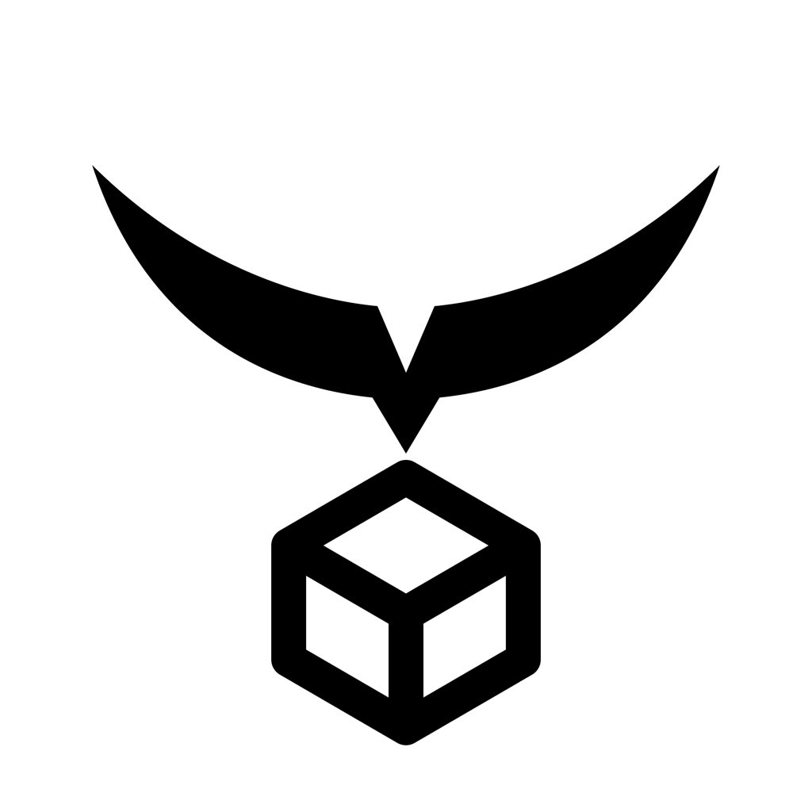

  

# 灵构AI｜LINGO AI 品牌与产品设计理念

> **中文品牌：灵构AI**  
> **英文品牌：LINGO AI**  
> **核心口号：From Intent to Form.**  
> **中文表达：从意图，到成形。**

---

## 一、品牌定义

**LINGO AI** 是一个面向 AI 3D 创作与实体制造的智能平台。

它帮助用户把一句话、一张图片、一个模糊想法，转化为可理解、可编辑、可检查、可打印的三维模型，并进一步连接材料、设备与真实制造。

LINGO AI 关注的不只是“生成一个模型”，也不只是“把模型打印出来”，而是建立一条从人的表达，到机器理解，再到实体成形的完整连接。

> **让人用自然的方式表达，让 AI 负责理解和构造，让想法最终成为真实的东西。**

---

## 二、英文名：LINGO AI

### 1. LINGO 的语义

`Lingo` 在英文中指语言、表达方式或某个领域的专门语言。这个词与产品的核心入口高度相关：用户不需要先掌握复杂的建模术语，而是可以用自己的语言表达想法。

在品牌中，LINGO 不仅代表“说出来”，也代表一种人与 AI 协作的新语言：

- 用自然语言描述想法；
- 用图片表达风格和方向；
- 用对话确认需求和约束；
- 用模型、参数和制造结果完成沟通。

### 2. LINGO 与“灵构”的关系

- **灵**：灵感、理解、想象和智能响应；
- **构**：结构、建模、组合和实体成形；
- **LINGO**：把用户的表达变成 AI 可以理解的创造起点；
- **AI**：将表达进一步转化为结构、模型和制造结果。

因此，`LINGO AI` 的品牌含义可以概括为：

> **理解你的语言，构造你的想法。**

它既保留了“灵”的发音联想，也通过 `Lingo` 的真实英文含义建立了产品的语言入口和 AI 属性。

---

## 三、品牌口号

### 主口号

# From Intent to Form.

中文表达：

> **从意图，到成形。**

这里的 `Intent` 不只是文字输入，而是用户真正想做的东西、使用场景、风格偏好和制造要求；`Form` 也不只是视觉形状，而是经过结构判断、尺寸确认和打印验证之后，可以进入现实的三维实体。

### 口号所表达的品牌承诺

- 用户可以从不完整的想法开始；
- AI 会理解意图，而不是只执行关键词；
- 模型会从概念逐渐变成结构；
- 结构会经过可制造性判断；
- 最终结果可以离开屏幕，进入现实空间。

### 辅助表达

- **Describe it. Shape it. Make it real.**  
  描述它，构造它，让它成为现实。
- **Your idea, made tangible.**  
  让你的想法变得触手可及。
- **AI that understands making.**  
  理解制造的 AI。

日常产品和品牌主视觉优先使用 `From Intent to Form.`，其他表达可用于活动、官网和产品功能说明。

---

## 四、产品定位

### 一句话定位

**LINGO AI 是面向创作者和制造者的 AI 3D 创作与打印平台。**

### 产品本质

LINGO AI 位于以下几类工具的交汇处：

- AI 对话与意图理解；
- AI 图片和 3D 模型生成；
- 三维模型编辑与结构调整；
- 可打印性检测与自动修复；
- 切片参数、材料和成本管理；
- 3D 打印设备连接与任务管理；
- 模型分享、复用和社区协作。

它不是一个只负责生成图像的 AI 工具，也不是一个只负责管理打印机的后台系统，而是将**创意表达、三维结构和实体制造**连接起来的工作台。

### 产品差异

传统建模软件通常要求用户先学习复杂的工具和专业流程；普通 AI 生成工具往往停留在图片或不可制造的模型阶段；传统打印软件则通常从已经完成的模型开始。

LINGO AI 的不同之处在于：

> **从用户还没有模型的时候开始，一直陪伴到模型真正被制造出来。**

---

## 五、目标用户

### 1. 普通创作者与兴趣用户

他们有想法，但没有专业建模能力，希望快速制作摆件、钥匙扣、收纳件、礼物、玩具或个性化物品。

他们需要：

- 低门槛的表达方式；
- 清楚的 AI 反馈；
- 不需要理解所有专业参数；
- 能够确认模型是否真的可以打印；
- 从想法到成品的完整陪伴。

### 2. 设计师与 3D 创作者

他们已经具备视觉和建模能力，但希望减少重复操作、快速探索方案，并提高模型进入制造环节的效率。

他们需要：

- 更快的概念生成和版本探索；
- 可控的风格、比例和结构调整；
- 模型检测、修复和切片辅助；
- 可追踪的版本和资产管理；
- 方便分享、协作和复用的工作空间。

### 3. Maker、工作室与小型制造团队

他们既需要创作自由，也需要管理多个模型、设备、材料和打印任务。

他们需要：

- 多项目、多设备和多材料管理；
- 统一的打印任务视图；
- 时间、耗材和成本的透明信息；
- 失败风险提醒和可执行的修复建议；
- 从个人创作扩展到小规模生产的能力。

### 4. 教育与创客空间

学校、工作坊和创客空间需要让学生理解从想法到实体的过程，而不是只学习某一个软件的按钮。

他们需要：

- 容易上手的创作入口；
- 可解释的模型结构和打印知识；
- 适合教学演示的项目记录；
- 安全、清晰、可复盘的制造过程；
- 鼓励分享和协作的模型社区。

### 5. 产品团队与实体品牌

他们希望快速验证产品形态、制作样件、测试外观和功能，而不必一开始就投入完整的工业建模流程。

他们需要：

- 从文字需求到初步结构的快速验证；
- 多个方案的生成与比较；
- 尺寸、结构和可制造性检查；
- 便于沟通的模型版本和评审记录；
- 更短的概念到样件周期。

### 核心用户画像

LINGO AI 的核心用户不是单纯的专业工程师，也不是只想生成一张图片的人，而是：

> **有具体想法，希望把它做成真实物体，但不想被复杂工具和制造门槛阻挡的人。**

---

## 六、产品价值

### 让表达成为建模入口

用户不需要先知道应该使用哪个工具，也不需要先画出完整草图。描述、图片和对话都可以成为三维创作的入口。

### 让 AI 理解真实意图

AI 不应只理解“恐龙”“花瓶”“机器人”等关键词，还要理解用途、尺寸、风格、材料、稳定性和打印限制。

### 让模型从一开始就考虑制造

可打印性不是完成设计之后才检查的问题。结构、壁厚、底座、悬空、尺寸和材料都应当在生成与调整时被考虑。

### 让专业信息变得可理解

复杂的检测结果需要被解释成用户可以采取行动的建议，而不是只展示错误代码和工程术语。

### 让数字创作产生实体结果

最终价值不在于屏幕上的模型数量，而在于用户能否把重要的模型稳定地打印出来、使用起来并分享给别人。

---

## 七、品牌设计理念

### 1. 灵感不应被工具限制

品牌首先尊重用户的想法，而不是要求用户适应软件。创作应该从表达开始，而不是从学习工具开始。

### 2. 结构是想法变成现实的桥梁

灵感只有进入结构，才能被调整、验证和制造。品牌中的“构”代表将抽象想法变成有空间关系、有尺寸约束、有物理可能性的模型。

### 3. 美观与可制造性同样重要

一个模型既要有表达力，也要能够承受现实世界的材料、重力和设备限制。制造约束不是创意的敌人，而是让创意真正落地的条件。

### 4. 智能应该帮助人做决定

AI 可以提出方案、解释风险、推荐修复方式，但重要的选择仍然应该被用户看见和确认。LINGO AI 追求的是可理解的智能，而不是不可解释的自动化。

### 5. 从数字到实体是一条连续关系

模型、切片、设备和成品不应被看成互相割裂的环节。每一个数字结果都应该能够自然地连接到后续的真实制造。

### 6. 复杂能力应该呈现得简单

后台可以很复杂，用户看到的体验应当清楚、克制、有秩序。品牌要把技术的复杂度留在系统内部，把判断和行动变得容易理解。

### 7. 每一个作品都可以继续生长

模型不是一次性生成的终点，而是可以被调整、修复、复用、分享和再创造的资产。LINGO AI 鼓励持续迭代，也鼓励开放协作。

---

## 八、Logo 核心隐喻

Logo 由上部弧形、中央连接关系和下方立方体构成，代表从理解到成形的品牌关系。

### 上部弧形：理解、灵感与方向

上扬的弧角像工具路径、展开的双翼，也像一个正在打开的创造空间。

它代表：

- AI 捕捉用户意图；
- 灵感被激活并向前推进；
- 生成过程中的速度和能量；
- 面向未来的开放能力。

弧形不是封闭的边界，而是一条带有方向的路径。它表示品牌始终在帮助用户把想法向现实推进。

### 中央连接：语言与结构之间的转译

中央连接关系象征材料线、数字路径和 AI 的转译能力。

它连接：

- 人的语言与机器的理解；
- 图片与三维结构；
- 模型与切片指令；
- 数字世界与真实设备。

这是 LINGO AI 的核心价值：不只是听懂用户说了什么，而是继续把它构造成可以被制造的东西。

### 下方立方体：模型与实体

下方立方体代表三维模型、空间结构和最终成形的实体。

开放的线性结构强调：

- 模型具有空间秩序；
- 结构可以被检查和调整；
- 结果可以继续迭代；
- 数字形体最终能够进入现实。

---

## 九、视觉语言

### 形态关键词

`Arc` · `Path` · `Mesh` · `Form` · `Layer` · `Void`

视觉形态围绕五个动作建立：

- **上扬**：表达洞察、启动和前进；
- **连接**：表达沟通、转译和协作；
- **展开**：表达开放、生成和探索；
- **成形**：表达结构、模型和实体；
- **留白**：表达未被限定的创造空间。

### 色彩原则

- **黑与白**：结构、准确、专业和长期识别；
- **蓝与青**：数字空间、云端连接和技术可信度；
- **蓝紫**：生成式 AI、想象力和未来感；
- **渐变**：表达从意图到形体、从平面到立体的变化。

渐变不应只是装饰，而应当服务于“生成、转译、成形”的概念。Logo 必须同时具备稳定的黑白版本，以适应产品导航、设备铭牌、印刷、包装和缩小场景。

### 字标原则

“灵构AI / LINGO AI”的字标应当清晰、现代、易读、易缩放。

- 中文字标体现亲和力和品牌记忆；
- 英文字标体现开放、国际化和平台属性；
- `AI` 应作为能力标识存在，但不应压过品牌名称；
- 字形可以有结构切角或轻微几何处理，但不能牺牲识别度；
- 在产品界面中保持克制，在品牌传播中可以使用层积、路径和生成动效。

---

## 十、产品体验原则

### 清楚地开始

用户打开产品后，应当知道可以从文字、图片或模型开始，不需要先理解完整的 3D 工作流。

### 让 AI 先理解，再生成

在生成之前，系统应帮助用户确认对象、风格、用途、尺寸和限制，减少“生成了但不是我想要的”这种断裂感。

### 让每个结果都可解释

模型、检测、修复和切片结果都应说明“发生了什么”和“为什么”，让用户能够理解并做出选择。

### 让错误变成下一步建议

检测到问题时，不只告诉用户失败原因，还要提供明确、可执行的修复方向。

### 让制造信息透明

时间、材料、成本、支撑和设备状态应当被清楚呈现，让用户对最终结果有预期。

### 保留人的确认权

自动化可以减少操作，但关键的模型版本、修复方式、打印设备和最终确认仍然应该由用户掌握。

### 让成品回到创作社区

完成的模型可以被保存、复用、分享、评价和再次改造，让每一次制造都成为下一次创作的基础。

---

## 十一、品牌语气

### 应该是

- 清楚的
- 有帮助的
- 专业但不生硬的
- 鼓励尝试的
- 解释原因的
- 尊重用户决定的
- 关注最终结果的

### 不应该是

- 只堆砌 AI、未来、智能等空泛词汇；
- 用工程术语制造距离感；
- 把复杂流程全部推给用户；
- 只展示漂亮效果，不说明能否制造；
- 用过度夸张的语气承诺不确定的结果；
- 把打印当成模型生成后的附属功能。

### 推荐表达方式

不要说：

> 检测失败，Mesh topology invalid。

更适合说：

> 这个模型有一处断开的表面，打印时可能会出现缺层。建议先修复结构，再继续切片。

不要说：

> AI 自动生成高质量 3D 模型。

更适合说：

> 描述你的想法，LINGO AI 会帮你把它构造成可以继续调整和打印的三维模型。

---

## 十二、品牌主张

### 核心主张

> **LINGO AI，让语言成为形体，让想法真正成形。**

### 对用户的承诺

- 你不需要先成为专业建模师；
- 你可以用自己的方式描述想法；
- 你可以看到模型为什么这样生成；
- 你可以知道它是否适合制造；
- 你可以在重要节点做出自己的决定；
- 你最终得到的不只是一个文件，而是一个真实的东西。

### 品牌关键词

`Intent` · `Understanding` · `Structure` · `Generation` · `Making` · `Form`

中文对应：

`意图` · `理解` · `结构` · `生成` · `制造` · `成形`

---

## 十三、最终设计结论

LINGO AI 的品牌识别不依赖复杂的装饰，而依赖一个始终清晰的核心关系：

> **语言是入口，AI 是转译，结构是桥梁，实体是结果。**

中文品牌“灵构AI”强调灵感与结构，英文品牌“LINGO AI”强调语言与理解。二者共同表达同一个产品信念：

> **从用户说出想法的那一刻开始，帮助它逐渐成为可以被看见、被理解、被制造的真实形体。**
