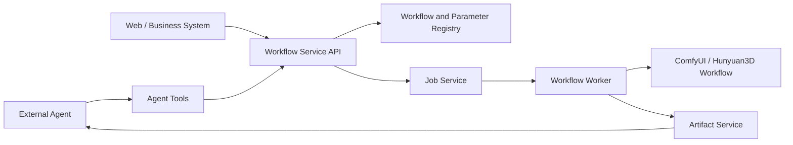

# 提案：Hunyuan3D 多视图生成对外开放

## 动机 / 用户故事

项目计划接入外部 Agent，由 Agent 根据用户需求调用 Hunyuan3D 多视图生成能力并动态调整生成参数。ComfyUI 适合模型编排和内部调试，但其节点、连线和文件处理方式不适合作为长期稳定的外部协议，因此需要在 ComfyUI 与外部 Agent 之间建立标准化服务层。

## 目标用户

- 通过 Agent 调用多视图生成能力的外部系统
- 使用 Web、业务系统、SDK 或 Agent Adapter 接入生成服务的调用方
- 负责工作流、参数、任务和运行治理的平台工程人员

## 现有做法及不足

直接暴露 ComfyUI 会把节点 ID、连线结构、服务器路径和内部文件处理方式变成外部依赖。工作流升级后，外部调用容易破坏；同时缺少统一的参数发现、异步任务、产物访问、权限、配额、审计和扩展边界。

## 本期范围

本期做：

- 在外部 Agent 与 ComfyUI 之间增加统一的 Workflow Service Gateway。
- 通过标准 API 和 Agent Tool 暴露稳定的业务语义，而不是暴露 ComfyUI 节点和连线。
- 建立 Workflow、Parameter、Job、Artifact 和 Agent Tool 五个能力域。
- 对外暴露工作流输入、输出和全部具有业务意义的可配置参数；Agent 可查询参数名称、用途、类型、默认值和约束，并在有权限时覆盖参数。
- 以异步方式管理生成任务的创建、排队、执行、进度、取消、失败和重新生成；任务提交后参数冻结。
- 统一管理输入图片、生成模型、纹理、预览图和任务记录等 Artifact，使用 ID 和受控地址访问，不直接暴露服务器文件路径。
- 以 OpenAPI 和 JSON Schema 作为 API 与 Agent Tool 的共同契约来源。
- 对工作流、参数 Schema 和 Tool 进行显式版本化，支持兼容升级和不兼容变更的版本区分。
- 在 Gateway 层统一处理鉴权、租户隔离、调用方权限、频率与并发、GPU 配额、输入安全、输出访问、超时取消、审计和 Webhook 安全。
- 为任务提供可观测性和可追溯性，记录调用方、工作流及版本、输入、最终参数、状态、执行时间、产物和失败或取消原因。
- 为后续接入更多 3D 模型和工作流保留统一扩展方式。

本期明确不做：

- 不让外部调用方直接依赖 ComfyUI 原始 graph、节点 ID、连线结构或服务器路径。
- 不在本期确定具体字段、接口路径、节点映射、数据库方案或某个 Agent 平台的专属协议；这些细节待讨论。
- 不把公网鉴权和多租户治理交给 ComfyUI 内部执行引擎。
- 不要求一次性接入所有未来工作流；本期以 Hunyuan3D 多视图工作流为首个对外 Profile。

## 关键决策与依据

### 备选方案

1. 外部 Agent 直接调用 ComfyUI。
   - 优点：链路短，初期接入成本低。
   - 缺点：外部协议被内部节点结构和文件路径绑定，升级和治理困难。
2. 只提供一套面向单个 Agent 平台的 Tool。
   - 优点：调用体验直接。
   - 缺点：业务系统、SDK 和其他 Agent 需要重复适配，业务逻辑可能分裂。
3. 以标准 API 为事实来源，在其上提供 Agent Tool Adapter，并通过 Gateway 连接异步任务和内部工作流。
   - 优点：隔离内部实现，统一 API 与 Tool，便于治理和扩展。
   - 缺点：需要建设契约、参数注册、任务和产物等平台能力。

### 本期选择

选择方案 3。

原因：外部稳定性、参数可发现性、异步任务可追溯性和治理能力都不能依赖 ComfyUI 内部结构。统一 API 契约可以同时服务业务系统和 Agent，Gateway 也为后续接入更多工作流保留扩展点。

## 基本概念与信息结构

### Workflow Profile

描述一个可对外调用的工作流，包括用途、输入输出类型、参数定义、版本和内部映射。外部只依赖稳定的业务语义。

### Parameter Schema

描述参数名称、用途、类型、默认值、约束、权限和资源成本。任务提交后保存用户输入值和最终生效值。

### Job

异步生成任务，包含创建、排队、执行、进度、取消、失败和重新生成等生命周期。任务提交后参数冻结，修改通过新任务完成。

### Artifact

输入图片、生成模型、纹理、预览图和任务记录等受控文件对象，包含文件类型、格式、哈希、所属任务、访问权限和保留策略。

### 版本

每个对外工作流拥有 `Workflow ID`、`Workflow Version`、`Parameter Schema Version` 和 `Tool Major Version`，用于兼容性和追溯。

## 原型 / 演示

典型链路为：Agent 查询工作流能力与参数 → 提供输入并设置参数 → 提交生成任务 → 查询任务状态 → 获取模型和相关产物。

## 验收标准

### 例子 1：工作流能力发现

- 现状：外部调用方需要理解 ComfyUI 节点和内部工作流文件。
- 提议后的行为：调用方通过 Workflow Service 查询 Hunyuan3D 多视图 Workflow Profile 的用途、输入、输出和版本。
- 验收：调用方不读取 ComfyUI graph，也能获得可调用工作流及其版本、输入输出说明和参数 Schema。

### 例子 2：全参数查询与设置

- 现状：参数分散在内部节点中，Agent 无法稳定发现或设置。
- 提议后的行为：Agent 查询所有具有业务意义的参数，并设置有权限覆盖的参数；节点连接和隐藏内部参数不对外开放。
- 验收：参数查询结果包含名称、用途、类型、默认值和约束；提交任务后记录用户输入值与最终生效值；尝试设置未声明参数时被拒绝并列出无效参数名。

### 例子 3：异步任务生命周期

- 现状：多视图生成是长耗时流程，直接同步调用难以反馈进度、取消和失败。
- 提议后的行为：API 创建异步 Job，支持排队、执行、进度、取消、失败和重新生成。
- 验收：提交输入图片和参数后获得 Job 标识；可以查询状态和进度、取消未完成任务，并在失败时获得结构化原因；修改参数通过新 Job 完成，原 Job 的参数快照不变。

### 例子 4：标准化产物与路径隔离

- 现状：外部系统可能依赖服务器本地路径和内部文件名。
- 提议后的行为：输入图片、生成模型、纹理和预览图作为 Artifact 管理，外部通过 ID 和受控地址访问。
- 验收：任务完成后返回标准化产物标识、类型和受控访问信息；响应中不暴露服务器本地路径；产物与任务及访问权限可追溯。

### 例子 5：API 与 Agent Tool 共享契约

- 现状：API 和 Agent Tool 分别维护时，参数和错误语义容易分叉。
- 提议后的行为：OpenAPI 和 JSON Schema 作为接口事实来源，Agent Tool 只负责描述、请求转换和结构化结果转换。
- 验收：同一工作流通过标准 API 和 Agent Tool 查询到的参数约束、任务状态和错误语义一致；Tool 不重新实现生成业务逻辑。

### 例子 6：版本兼容与扩展

- 现状：内部工作流变化可能直接破坏外部调用。
- 提议后的行为：显式维护 Workflow、Parameter Schema 和 Tool 版本；兼容变更保持语义稳定，不兼容变更升级版本并保留追溯关系。
- 验收：内部节点或连线调整但外部语义不变时，现有调用仍按原版本工作；删除参数、修改语义或改变输出结构时，调用方能看到新的版本边界和变更说明。

### 例子 7：安全、配额与可追溯性

- 现状：直接暴露执行引擎无法统一处理鉴权、租户、资源和审计。
- 提议后的行为：Gateway 统一执行权限、配额、输入校验、并发限制、超时取消、Webhook 签名和参数审计。
- 验收：无权限调用方、超出配额的调用和不安全输入被拒绝；每个任务记录调用方、工作流及版本、最终参数、状态、时间、产物和失败或取消原因。

### 例子 8：非法情况

- 现状：外部调用方可能直接传入原始 ComfyUI graph、服务器路径或高风险未授权参数。
- 提议后的行为：Gateway 只接受声明过的业务参数和受控 Artifact，不执行外部提交的内部 graph 或本地路径。
- 验收：提交未声明参数、原始节点连接、服务器路径、无权限高成本参数或不符合输入约束的文件时，任务不创建，并返回结构化拒绝原因；ComfyUI 不直接暴露公网接口。
