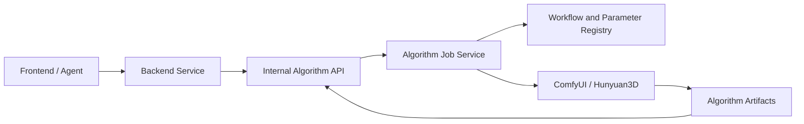

# 提案：Hunyuan3D 多视图算法服务边界

## 动机 / 用户故事

算法组负责把后端提供的文本、图片或多视图输入转换为 3D 模型。ComfyUI、Hunyuan3D、节点参数、内部队列和生成中间态属于算法服务内部实现，后端只依赖稳定接口提交任务并获取结果。

## 目标用户

- 调用 3D 生成能力的后端开发人员
- 维护 Hunyuan3D、ComfyUI 和生成服务的算法工程师

后端服务是唯一业务调用方。前端、外部 Agent、SDK 和终端用户不得直接调用算法服务或 ComfyUI。

## 本期范围

算法服务负责：

- 接收后端提交的约定输入和允许覆盖的业务参数。
- 校验输入、创建幂等异步算法任务并返回 `algorithmJobId`。
- 管理内部 Workflow、Parameter、AlgorithmJob 和 Artifact。
- 执行 ComfyUI / Hunyuan3D 工作流及 GPU 调度。
- 提供稳定任务状态、进度、取消和结构化错误。
- 返回 GLB、预览图及内容哈希、算法版本和参数快照。
- 隔离节点 ID、graph、模型路径、内部队列和中间文件。
- 通过服务间认证和网络策略限制调用来源。

后端负责：

- 用户身份、权限、配额和业务任务状态。
- 输入资产归属、用户确认和产品规则。
- 将业务任务与 `algorithmJobId` 建立映射。
- 面向前端或 Agent 提供业务 API 与工具能力。
- 接收算法产物后进入模型资产、检查、编辑、切片和打印流程。

## 明确不做

- 不让外部 Agent、Web、SDK 或前端直接调用算法服务。
- 不在算法服务中实现用户、多租户、收藏、社区、打印或终端权限。
- 不对后端暴露原始 ComfyUI API、graph、节点、路径或内部 Profile。
- 不把生成成功解释为可打印性检查通过。
- 不在本提案中定义后端产品工作流。

## 模块与调用关系

算法内部包含：

- `WorkflowRegistry`：工作流模板、版本和节点映射。
- `ParameterSchema`：后端可配置参数与算法内部参数。
- `AlgorithmJob`：幂等、队列、状态、取消、重试和恢复。
- `AlgorithmArtifact`：GLB、预览图、哈希和生成元数据。

后端可见接口只包含提交、查询、取消、获取结果和健康检查。具体字段以算法 API 规范为唯一事实来源。

## 关键决策

### 备选方案

1. 后端或 Agent 直接调用 ComfyUI。
   - 实现快，但会绑定节点、graph、路径和内部队列。
2. 算法组提供黑盒服务，后端只调用稳定 API。
   - 增加适配层，但职责、升级和故障边界清晰。

选择方案 2。算法组拥有从输入到 3D 产物的完整生成过程，后端拥有产品与业务流程。

## 验收标准

### 例子 1：唯一调用边界

- 只有经过服务间认证的后端服务可以提交算法任务。
- 前端、外部 Agent 和公网请求无法直接访问算法服务或 ComfyUI。

### 例子 2：黑盒执行

- 后端提交约定输入后获得 `algorithmJobId`。
- 后续响应仅包含稳定状态、错误和产物，不出现 graph、节点 ID、内部队列 ID 或服务器路径。

### 例子 3：内部升级

- ComfyUI 节点、连线或模型路径调整但接口语义不变时，后端无需修改。
- 破坏性接口变化必须发布新 API 版本。

### 例子 4：异步与幂等

- 同一幂等键和相同输入不会重复创建 GPU 任务。
- 后端可以查询、取消允许取消的任务，并获得结构化失败原因。

### 例子 5：产物追溯

- 成功任务返回完整 GLB 和必要元数据，并可追溯输入哈希、工作流版本、参数快照和输出哈希。
- 产物交给后端后，后续可打印性检查和业务状态由后端负责。
